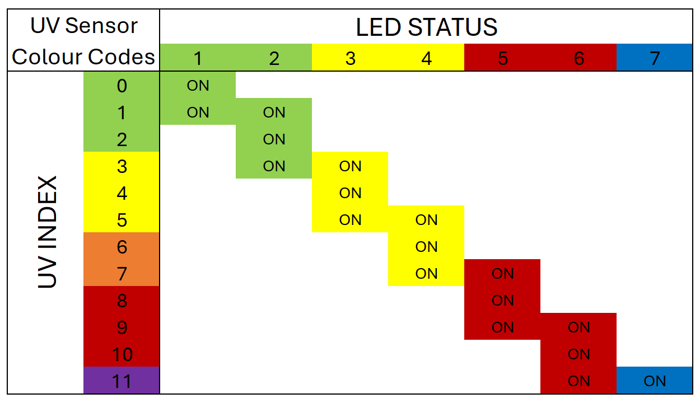

# Wearable UV Index Sensor
Hardward and software for a wearable UV sensor

The UV sensor is designed to be as small as possible while still providing the wearer with useful information regarding the current UV index. 

# LED Colour Mapping
The colours of the LEDs indicate the current UV index. The following map 

# Build List
The components in the following list were selected for their small form factors to minimize the size of the finished circuit. A slightly larger version could easily be built using through-hole components exclusively. 

The current fritzing diagram uses SMD form factor 0805 for the components.

## Main Circuit Assembly
* 1x M0 Trinket ([Adafruit Product ID: 3500](https://www.adafruit.com/product/3500))
* 1x JST-PH 2-Pin SMT Right Angle Connector ([Adafruit Product ID: 1769](https://www.adafruit.com/product/1769))
* 1x Analog UV Light Sensor Breakout - GUVA-S12SD ([Adafruit Product ID: 1918](https://www.adafruit.com/product/1918))
* 1x 74HC595 Shift Register (SMD form factor 0805)
* 1x 0.1 uF ceramic capacitor (SMD form factor 0805)
* 8x 220 Ohm resistor (SMD form factor 0805) **NOTE: final resistance valus are TBD**
* 2x Green LED (SMD form factor 0805)
* 2x Yellow LED (SMD form factor 0805)
* 2x Red LED (SMD form factor 0805)
* 1x Blue LED (SMD form factor 0805)
* 1x Custom printed PCB (see [fritzing file](./Fritzing/UV_sensor_diagrams.fzz))
* 1x 3D Printed enclosure (coming soon)

## Power Supply Components
* 1x Breadboard-friendly SPDT Slide Switch ([Adafruit Product ID: 805](https://www.adafruit.com/product/805))
* 1x Small Li-Poly battery with 2-pin JST-PH connector (I used a Lithium Ion Polymer Battery - 3.7v 40mAh from Amazon) **VERIFY POLARITY BEFORE USING**

## Additional Components
* 1x Micro-Lipo Charger for LiPoly Batt with USB Type C Jack ([Adafruit Product ID: 4410](https://www.adafruit.com/product/4410))
* 1x Soldering equipment (iron, solder, microscope or magnifier, tweezers, etc.)

# Assembly Instructions (coming soon)
## 3D Printed Enclosure

## PCB Assembly

## Use and Maintenance
